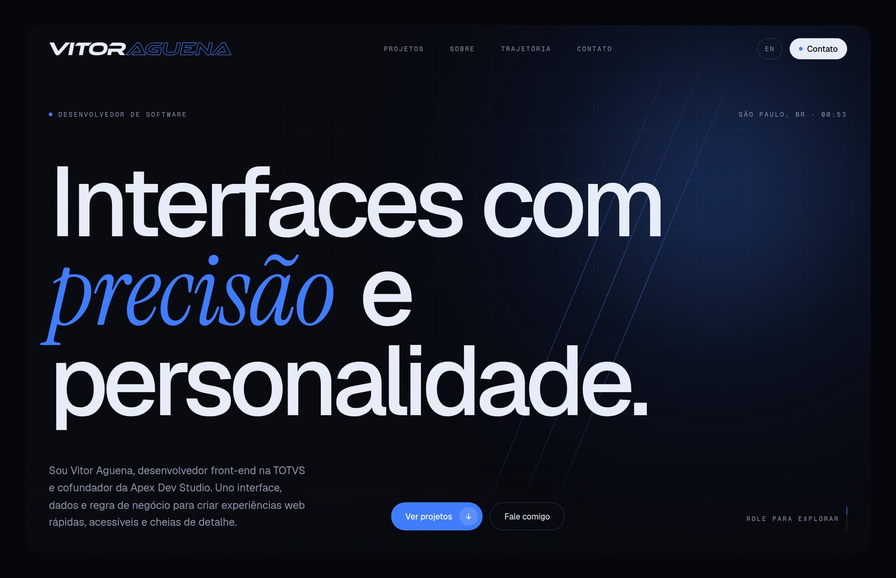
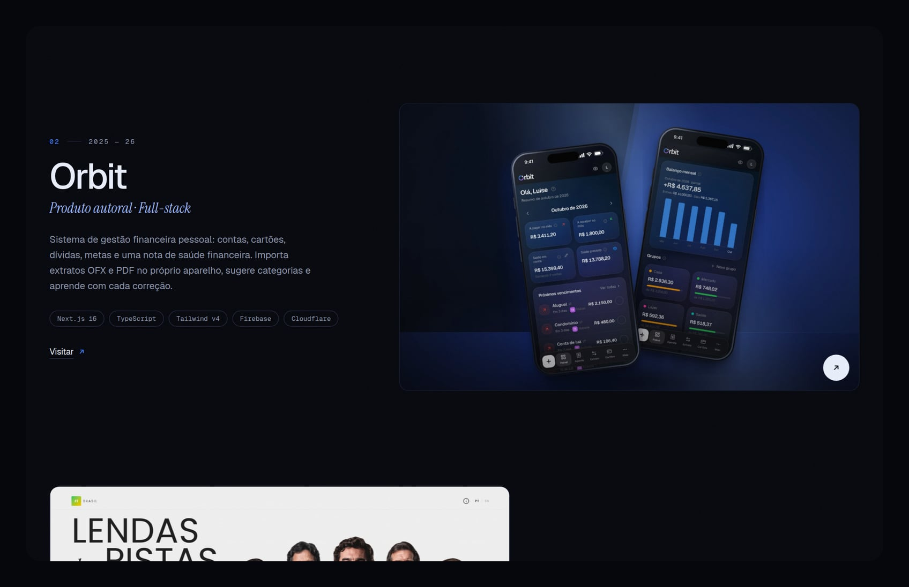
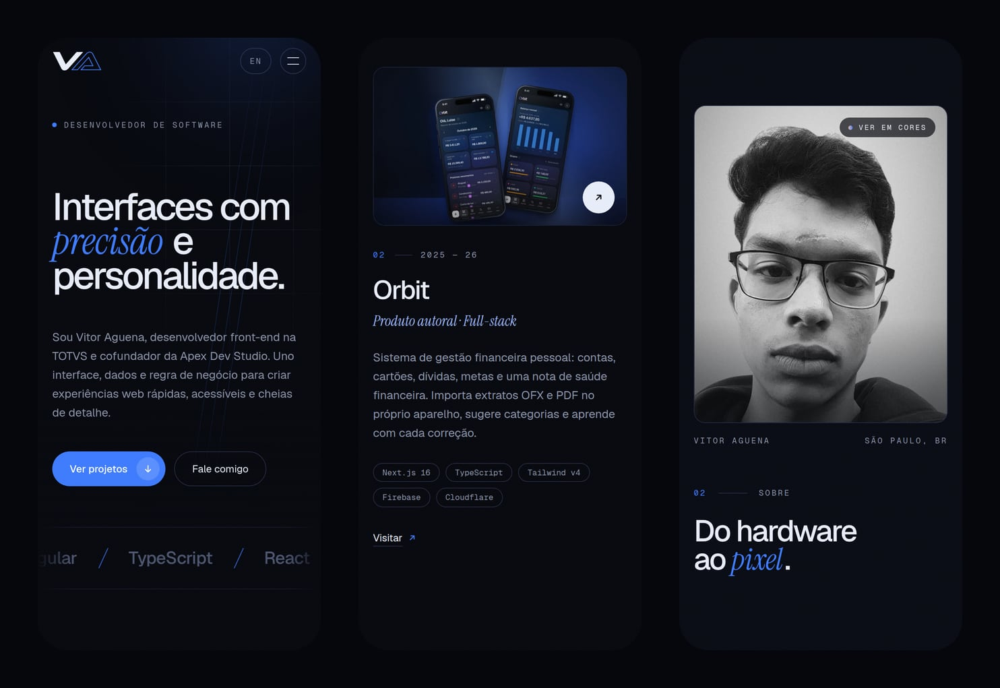

  <picture>
    <source media="(prefers-color-scheme: dark)" srcset="docs/logo-dark.svg">
    
  </picture>

# 🔵 Vitor Aguena · Portfólio

Meu portfólio profissional: moderno, minimalista e feito à mão, sem templates. A identidade parte da minha logo, com **VITOR** sólido e **AGUENA** vazado em azul, e se espalha pelo site num fundo azul-noite, um único azul de destaque e títulos com um toque de itálico serifado. Cada detalhe foi pensado para mostrar, na prática, o que eu faço como desenvolvedor front-end.

🚀 **Acesse online:** [vitoraguena.pages.dev](https://vitoraguena.pages.dev/)

  

---

## 🌟 Principais Features e Diferenciais

O site foi construído como uma **experiência**: cada rolagem, cada passagem do mouse e cada clique tem uma resposta.

- ✍️ **Abertura com a logo sendo desenhada:** o traço de cada letra se desenha, o preenchimento entra, um contador vai até 100 e a cortina sobe revelando o hero. Aparece uma vez por sessão, para não cansar quem navega.
- 🖱️ **Cursor próprio:** um ponto azul exato e um anel que segue com atraso. Em links o anel cresce; sobre os projetos vira uma bolha com "Visitar ↗".
- 🌊 **Rolagem suave e parallax:** scroll com [Lenis](https://lenis.darkroom.engineering/), imagens que se movem dentro da moldura e abrem como cortina ao entrar na tela.
- 🏎️ **Faixa da stack que reage ao scroll:** acelera conforme a velocidade da rolagem e inverte o sentido quando a página sobe.
- 🧲 **Botões magnéticos:** os CTAs são puxados na direção do cursor.
- 💻 **Textos que se decodificam:** navegação e rótulos embaralham e se resolvem letra a letra, como num terminal.
- 🎨 **Retrato com lente de cor:** a foto em preto e branco revela a versão colorida numa lente de borda suave que segue o mouse. No celular, um toque alterna entre as duas.
- 🌍 **Bilíngue (PT/EN):** português em `/` e inglês em `/en`, cada idioma com rota, metadados e atributo `lang` próprios.
- 📱 **Mobile First:** logo compacta "VA", menu em tela cheia e layouts pensados para o celular.
- ♿ **Acessibilidade:** HTML semântico, link para pular ao conteúdo, foco visível, textos alternativos nos dois idiomas e **respeito ao `prefers-reduced-motion`**. Sem JavaScript, nenhum conteúdo fica escondido.

---

## 🧭 As Seções

| # | Seção | Destaque |
|---|---|---|
| — | **Hero** | Título que sobe linha a linha, brilho azul que segue o cursor e horário local de São Paulo |
| 01 | **Projetos** | Apex Dev Studio, Orbit e F1 Brasil, com mockups e prints reais, mais um arquivo dos projetos antigos |
| 02 | **Sobre** | Do hardware ao pixel: retrato com lente de cor, números animados e competências em cards com brilho |
| 03 | **Trajetória** | TOTVS, Apex Dev Studio, Master MR e MPF, além da formação e das certificações |
| 04 | **Contato** | E-mail em destaque com botão de copiar, redes e currículo em PDF |

  

  

---

## 🏗️ Arquitetura e Boas Práticas

- **Conteúdo em um só lugar:** todos os textos, projetos, experiências e links ficam em `src/content/site.ts`, com português e inglês lado a lado e tipados. Atualizar o portfólio não exige mexer em componente.
- **Dois idiomas, dois root layouts:** `src/app/(pt)` e `src/app/(en)` usam route groups, com um `global-not-found` próprio para o 404.
- **Um único loop de animação:** parallax, faixa da stack, barra de progresso e o fade do hero compartilham um só `requestAnimationFrame` (`scroll-loop.ts`), que entrega posição e velocidade suavizada do scroll.
- **Sem flash e sem conteúdo preso:** um script inline marca a página antes da primeira pintura. Se o JavaScript não carregar, uma rede de segurança libera todo o conteúdo em poucos segundos.
- **Identidade em tokens:** cores, fontes, curvas e animações definidas no bloco `@theme` do Tailwind CSS 4.
- **Performance:** páginas 100% estáticas, `next/image` com `sizes` ajustados ao layout, fontes via `next/font` e capas exportadas na resolução certa.
- **Tipagem estrita:** TypeScript em todo o projeto, com ESLint sem erros.

---

## 🛠️ Tecnologias e Ferramentas

- **Core:** [Next.js 16](https://nextjs.org/) (App Router, Cache Components), [React 19](https://react.dev/), [TypeScript](https://www.typescriptlang.org/)
- **Estilização:** [Tailwind CSS 4](https://tailwindcss.com/)
- **Smooth Scroll:** [Lenis](https://lenis.darkroom.engineering/)
- **Tipografia:** [Geist](https://vercel.com/font), Geist Mono e [Instrument Serif](https://fonts.google.com/specimen/Instrument+Serif)
- **Hospedagem:** [Cloudflare Pages](https://pages.cloudflare.com/)

---

## ⚖️ Créditos

O mockup da Orbit usa **dados fictícios**, gerados num ambiente de demonstração. Marcas e imagens dos projetos de terceiros pertencem aos seus respectivos detentores.

---

## 👤 Autor

**Vitor Aguena**
- 🌐 [Portfólio](https://vitoraguena.pages.dev/)
- 💼 [LinkedIn](https://www.linkedin.com/in/vitoraguena/)
- 🐙 [GitHub](https://github.com/vitoraguena17)
